# 16S Gut Microbiome Analysis Pipeline
This repo contains an R script that can be used in the analysis of 16S gut microbiome data. The scripts were developed by analysing the gut microbiome data from stingless bees. The 16S data was generated from an illumina platform by sequencing the V3-V4 region. The sequences used in developing this  script are paired end reads which have already been demultiplexed but still contain primers. The DADA2 workflow was adopted in this analysis because it is highly sensitive and specific as compared to other OTU picking algorithms, it can resolve single-nucleotide differences from amplicon data and classify them into Amplicon Sequence Variants (ASVs) and it contains an error correction model that helps in improving the quality of reads by helping best infer the original true bilogical sequences present in the data. More about Dada2 can be found in the [Dada2 paper](https://www.ncbi.nlm.nih.gov/pmc/articles/PMC4927377/), [Dada2 tutorial](https://benjjneb.github.io/dada2/tutorial.html) and the [Dada2 manual](https://www.bioconductor.org/packages/3.3/bioc/manuals/dada2/man/dada2.pdf).

__Working around with the data__

Load the dada2 package into R. If you have not installed dada2, follow the [turorial here](http://benjjneb.github.io/dada2/dada-installation.html)
```
library(dada2)
```

__Reading the fastq files into R__
```
file_path <- "test_data"
list.files(file_path)
```
        [1] "10K_DS40_L001_R1_001.fastq.gz" "10K_DS40_L001_R2_001.fastq.gz"
        [3] "11K_HA41_L001_R1_001.fastq.gz" "11K_HA41_L001_R2_001.fastq.gz"
        [5] "12K_HA42_L001_R1_001.fastq.gz" "12K_HA42_L001_R2_001.fastq.gz"

If the list of files that have been read match those you intend to analyze and your dada2 package was loaded you can start your dada2 analysis

__sorting the data into forward and reverse reads__
```
dataF <- sort(list.files(file_path, pattern="_R1_001.fastq.gz", full.names = TRUE))
dataF
```
        [1] "test_data/10K_DS40_L001_R1_001.fastq.gz" "test_data/11K_HA41_L001_R1_001.fastq.gz"
        [3] "test_data/12K_HA42_L001_R1_001.fastq.gz" "test_data/13K_HA43_L001_R1_001.fastq.gz"
        [5] "test_data/14K_HA44_L001_R1_001.fastq.gz" "test_data/15K_HA45_L001_R1_001.fastq.gz"

```
dataR <- sort(list.files(file_path, pattern="_R2_001.fastq.gz", full.names = TRUE))
dataR
```
        [1] "test_data/10K_DS40_L001_R2_001.fastq.gz" "test_data/11K_HA41_L001_R2_001.fastq.gz"
        [3] "test_data/12K_HA42_L001_R2_001.fastq.gz" "test_data/13K_HA43_L001_R2_001.fastq.gz"
        [5] "test_data/14K_HA44_L001_R2_001.fastq.gz" "test_data/15K_HA45_L001_R2_001.fastq.gz"

__Specifying the sample names for your dataset__
```
list.sample.names <- sapply(strsplit(basename(dataF), "_"), `[`, 2) #2 represents the second string on my sample names, if you want the first replace with 1
list.sample.names
```
      [1] "DS40"  "HA41"  "HA42"  "HA43"  "HA44"  "HA45"  "HA46"  "HA47"  "HA50"  "HG56" 
      [11] "DS31"  "HG57"  "LG74"  "LG75"  "LG76"  "LG77"  "LN71"  "LN72"  "LN73"  "MB10" 
      [21] "MB1"   "DS32"  "MB3"   "MB4"   "MB5"   "MB6"   "MB7"   "MB8"   "MFB16" "MFB17"
      [31] "MFB18" "MFB19" "DS33"  "MFB20" "MFB26" "MFB27" "MFB28" "MFB29" "MFB30" "MFR11"
      [41] "MFR12" "MFR13" "MFR14" "DS34"  "MFR15" "MFR21" "MFR22" "MFR23" "MFR24" "MFR25"
      [51] "NC68"  "DS35"  "DS36"  "DS37"  "DS38"  "DS39"

Here, you separate your forward and reverse reads and choose the string on the name of the file to be used as your sample names.

__visualizing the quality of the plots__

Visualizing the quality of your sequence data. Since most of the quality plots are closely similar in the two categories, you dont have to visualize the quality plots from all the samples in each of the categories. 
```
plotQualityProfile(dataR[1:5])
```
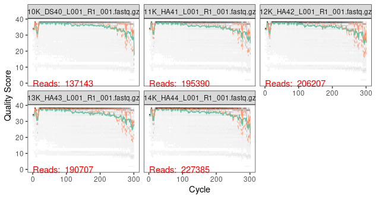

```
plotQualityProfile(dataF[1:5])
```
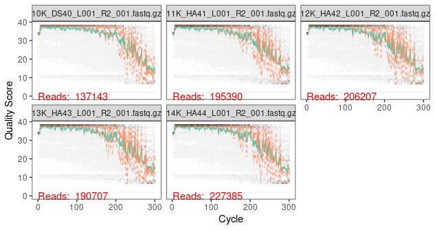

on these plot, the bases are on the X axis while the quality score is on the Y. Faint grey represents a heat map of the frequency of each quality score at each base position. Green shows the mean quality score per base and orange represents the quartiles of the quality score distribution. The forward reads generally usually have high quality bases while the reverse reads have more spurious reads as the sequencing process advances.  This plot also shows that our reads have primers as seen with the decreasing quality at the 5' end of each of the quality plots.

__Primer identification__

```
library(ShortRead)
library(Biostrings)
library(stringr)
```
```
fwd_primer <- "CCTACGGGNGGCWGCAG"
rev_primer <- "GACTACHVGGGTATCTAATCC"
```
```
#Function for creating all the possible orientations of these primers
allOrients <- function(primer) {
  require(Biostrings)
  dna <- DNAString(primer)  # The Biostrings works w/ DNAString objects rather than character vectors
  orients <- c(Forward = dna, Complement = Biostrings::complement(dna), Reverse = reverse(dna), 
               RevComp = reverseComplement(dna))
  return(sapply(orients, toString))  # Convert back to character vector
}
```
It is important to confirm all the possible orientations of the primers in the dataset in case one is unsure. since primers are double stranded sequences represented by the upper strand sequence in the 5' to 3' orientation, a complement to the sequence is the lower strand in the same orientation as the upeer strand. A reverse sequence is the sequence of the upper strand in the direction from the 3' to 5' end. A reverse complement is the sequence of the lower strand in the direction of its 5' to 3' end. 
```
# creating all the possible orientations using our forward and reverse primers

fwd_primer_orients <- allOrients(fwd_primer)
```
        Forward          Complement             Reverse             RevComp 
      "CCTACGGGNGGCWGCAG" "GGATGCCCNCCGWCGTC" "GACGWCGGNGGGCATCC" "CTGCWGCCNCCCGTAGG" 
```
rev_primer_orients <- allOrients(rev_primer)
rev_primer_orients
```
              Forward              Complement                 Reverse 
      "GACTACHVGGGTATCTAATCC" "CTGATGDBCCCATAGATTAGG" "CCTAATCTATGGGVHCATCAG" 
                RevComp 
      "GGATTAGATACCCBDGTAGTC"

```
fwd_primer_rev <- as.character(reverseComplement(DNAStringSet(fwd_primer))) # reverse complement of the primers
fwd_primer_rev
```
        [1] "CTGCWGCCNCCCGTAGG"

```
rev_primer_rev <- as.character(reverseComplement(DNAStringSet(rev_primer)))
rev_primer_rev
```
        [1] "GGATTAGATACCCBDGTAGTC"

```
# Function for counting the number of reads containing our primer orientations 
count_primers <- function(primer, filename) {
  num_hits <- vcountPattern(primer, sread(readFastq(filename)), fixed = FALSE)
  return(sum(num_hits > 0))
}
```
This helps in having the actual figure on the number of primers in the dataset while considering their orientation.
```
# counting the sequence strings with primers from our data 
rbind(R1_fwd_primer = sapply(fwd_primer_orients, count_primers, filename = dataF[[1]]), 
      R2_fwd_primer = sapply(fwd_primer_orients, count_primers, filename = dataF[[1]]), 
      R1_rev_primer = sapply(rev_primer_orients, count_primers, filename = dataF[[1]]), 
      R2_rev_primer = sapply(rev_primer_orients, count_primers, filename = dataF[[1]]))
```
                      Forward Complement Reverse RevComp
      R1_fwd_primer  130664          0       0       0
      R2_fwd_primer  130664          0       0       0
      R1_rev_primer       2          0       0      18
      R2_rev_primer       2          0       0      18

```
rbind(R1_fwd_primer = sapply(fwd_primer_orients, count_primers, filename = dataR[[1]]), 
      R2_fwd_primer = sapply(fwd_primer_orients, count_primers, filename = dataR[[1]]), 
      R1_rev_primer = sapply(rev_primer_orients, count_primers, filename = dataR[[1]]), 
      R2_rev_primer = sapply(rev_primer_orients, count_primers, filename = dataR[[1]]))
```
                     Forward Complement Reverse RevComp
      R1_fwd_primer     101        100      99     105
      R2_fwd_primer     101        100      99     105
      R1_rev_primer  130595         94      92      91
      R2_rev_primer  130595         94      92      91
In this dataset it is evident that majority of the forward and reverse primers the FWD primer appears in the forward orientation in the forward reads and in some of the reverse reads in its complement orientation. Similarly, the REV primer is also in its expected orientation. If the reverse primer matches the reverse in their reverse complement orientation, its important to replace the REV with its reverse complement orientation before proceeding.

__Primer trimming__

Primers here are trimmed using cutadapt. Other possible tools to adopt include trimmomatic. For cutadapt installation and usage guides follow [this link](https://cutadapt.readthedocs.io/en/stable/index.html). After installation, specify the path to cutadapt and confirm its version as a confirmation that you have its rightful path.
```
#specifying the path to cutadapt on the server
cutadapt <- "/opt/apps/cutadapt/1.18/bin/cutadapt" # change to the cutadapt path on your machine
system2(cutadapt, args = "--version") # test if the version of cutadapt you loaded matches that on the server
```
```
creating an output directory to store the trimmed files and specifying the names of the samples
cut_dir <- file.path(file_path, "cutadapt")
if (!dir.exists(cut_dir)) dir.create(cut_dir)

#creates a file path for the cutadapted reads within the cut_dir
fwd_cut <- file.path(cut_dir, basename(dataF)) 
rev_cut <- file.path(cut_dir, basename(dataR))

names(fwd_cut) <- list.sample.names
head(fwd_cut)
```
                                                     DS40 
        "test_data/cutadapt/10K_DS40_L001_R1_001.fastq.gz" 
                                              HA41 
        "test_data/cutadapt/11K_HA41_L001_R1_001.fastq.gz" 
                                              HA42 
        "test_data/cutadapt/12K_HA42_L001_R1_001.fastq.gz" 
                                              HA43 
        "test_data/cutadapt/13K_HA43_L001_R1_001.fastq.gz" 
                                              HA44 
        "test_data/cutadapt/14K_HA44_L001_R1_001.fastq.gz" 
                                              HA45 
        "test_data/cutadapt/15K_HA45_L001_R1_001.fastq.gz" 

```
names(rev_cut) <- list.sample.names
head(rev_cut)
```
                                                 DS40 
        "test_data/cutadapt/10K_DS40_L001_R2_001.fastq.gz" 
                                                HA41 
        "test_data/cutadapt/11K_HA41_L001_R2_001.fastq.gz" 
                                                HA42 
        "test_data/cutadapt/12K_HA42_L001_R2_001.fastq.gz" 
                                                HA43 
        "test_data/cutadapt/13K_HA43_L001_R2_001.fastq.gz" 
                                                HA44 
        "test_data/cutadapt/14K_HA44_L001_R2_001.fastq.gz" 
                                                HA45 
        "test_data/cutadapt/15K_HA45_L001_R2_001.fastq.gz" 

```
# function for creating cutadapt trimming log files
 
cut_logs <- path.expand(file.path(cut_dir, paste0(list.sample.names, ".log")))
```
```
# Function specifying the cutadapt functions to be used in this analysis
cutadapt_args <- c("-g", fwd_primer, "-a", rev_primer_rev, 
                   "-G", rev_primer, "-A", fwd_primer_rev,
                   "-n", 2,"-m",1, "-j",32, "--discard-untrimmed") 
```
Be keen to specify the orientation of the primers rightfully. Ideally, the forward primers should match the forward reads in their forward orientation and the reverse primers should match the reverse reads in their forward orientation.
```
# creating a loop over the list of files and running cutadapt on each file.
for (i in seq_along(dataF)) {
  system2(cutadapt, 
          args = c(cutadapt_args,
                   "-o", fwd_cut[i], "-p", rev_cut[i], 
                   dataF[i], dataR[i]),
          stdout = cut_logs[i])  
}
```
```
# sanity check: checking for the presence of primers in the first cutadapt-ed sample.
rbind(R1_fwd_primer = sapply(fwd_primer_orients, count_primers, filename = fwd_cut[[1]]), 
      R2_fwd_primer = sapply(fwd_primer_orients, count_primers, filename = fwd_cut[[1]]), 
      R1_rev_primer = sapply(rev_primer_orients, count_primers, filename = fwd_cut[[1]]), 
      R2_rev_primer = sapply(rev_primer_orients, count_primers, filename = fwd_cut[[1]]))
```
                       Forward Complement Reverse RevComp
      R1_fwd_primer       0          0       0       0
      R2_fwd_primer       0          0       0       0
      R1_rev_primer       0          0       0       0
      R2_rev_primer       0          0       0       0
```   
rbind(R1_fwd_primer = sapply(fwd_primer_orients, count_primers, filename = rev_cut[[1]]), 
      R2_fwd_primer = sapply(fwd_primer_orients, count_primers, filename = rev_cut[[1]]), 
      R1_rev_primer = sapply(rev_primer_orients, count_primers, filename = rev_cut[[1]]), 
      R2_rev_primer = sapply(rev_primer_orients, count_primers, filename = rev_cut[[1]]))
``` 
                        Forward Complement Reverse RevComp
      R1_fwd_primer      66         66      65      70
      R2_fwd_primer      66         66      65      70
      R1_rev_primer      59         60      58      57
      R2_rev_primer      59         60      58      57

      
From the cutadapted reads, all the primers in the forward and reverse reads were completely trimmed in the first sample. However the some reverse primers still remained in the forward and reverse reads. From this [github issue](https://github.com/benjjneb/dada2/issues/675), we find that since the number of reverse primers that have remained are fewer than what was initially present, they would not affect downstream analysis. 

  __plotting the quality plots again to determine the length to use while filtering reads__
  ```
  plotQualityProfile(fwd_cut[1:5])
  ```
  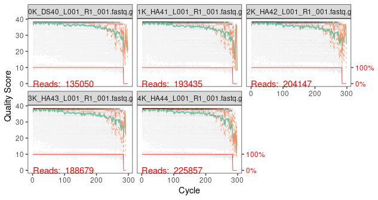
  ```
  plotQualityProfile(rev_cut[1:5])
  ```
  
  
  Note that unlike our first plot, this plot has a red line on the bottom to show the significant number of reads that were cutadapted.
  
__Assigning where the filtered data should be stored "filtered" directory__
```
filt.dataF <- file.path(file_path, "filtered", paste0(list.sample.names, "_F_filt.fastq.gz"))
filt.dataR <- file.path(file_path, "filtered", paste0(list.sample.names, "_R_filt.fastq.gz"))
```
```
#Defining the file names
names(filt.dataF) <- list.sample.names
head(filt.dataF)
```
                                  DS40                                      HA41 
        "test_data/filtered/DS40_F_filt.fastq.gz" "test_data/filtered/HA41_F_filt.fastq.gz" 
                                     HA42                                      HA43 
        "test_data/filtered/HA42_F_filt.fastq.gz" "test_data/filtered/HA43_F_filt.fastq.gz" 
                                     HA44                                      HA45 
        "test_data/filtered/HA44_F_filt.fastq.gz" "test_data/filtered/HA45_F_filt.fastq.gz" 

```
names(filt.dataR) <- list.sample.names
head(filt.dataR)
```
                                      DS40                                      HA41 
        "test_data/filtered/DS40_R_filt.fastq.gz" "test_data/filtered/HA41_R_filt.fastq.gz" 
                                     HA42                                      HA43 
        "test_data/filtered/HA42_R_filt.fastq.gz" "test_data/filtered/HA43_R_filt.fastq.gz" 
                                     HA44                                      HA45 
        "test_data/filtered/HA44_R_filt.fastq.gz" "test_data/filtered/HA45_R_filt.fastq.gz" 

__Filtering and trimming data__
```
out <- filterAndTrim(fwd_cut, filt.dataF, rev_cut, filt.dataR, truncLen=c(240,200),
                     maxN=0, maxEE=c(2,5), truncQ=2, rm.phix=TRUE,
                     compress=TRUE, multithread=TRUE)
head(out)
```
                                    reads.in reads.out
      10K_DS40_L001_R1_001.fastq.gz   135050    115628
      11K_HA41_L001_R1_001.fastq.gz   193435    160148
      12K_HA42_L001_R1_001.fastq.gz   204147    169970
      13K_HA43_L001_R1_001.fastq.gz   188679    154615
      14K_HA44_L001_R1_001.fastq.gz   225857    191037
      15K_HA45_L001_R1_001.fastq.gz   222596    182823                                    
This step aids in trimming all low quality reads. The first and the third variables contain the input files which are primer trimmed files. The second and the third hold the file names for the output forward and reverse sequences. __MaxEE__ on the code defines the quality filtering threshold based on the expected errors. In this particular code, all sequences with more than 2 erroneous bases in the forward reads and 5 erroneous reads in the reverse reads are filtered. Ids f the reverse reads in your dataset have better quality you can set __MaxEE (2,2)__. __rm.PhiX__ aids in deleting any read similar to the PHiX bacteriophage. __truncQ = 2__ trims all the bases that appear after the first quality score of 2 it comes across in aread. __MaxN = 0__ removes any sequences containing Ns and __truncLen__ identifies the minimum size to trim the forward and reads to keep the quality scores above 25.

__Checking the quality of the plots after trimming for low quality bases__
```
plotQualityProfile(fwd_cut[1:5])
```
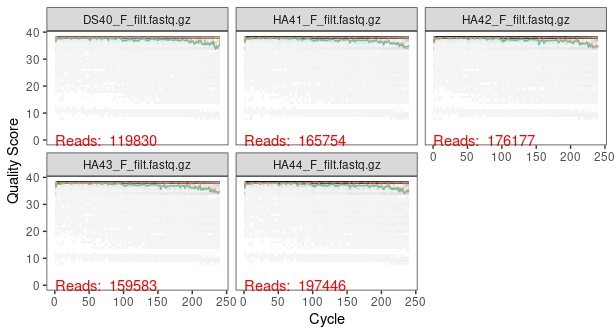

```
plotQualityProfile(rev_cut[1:5])
```
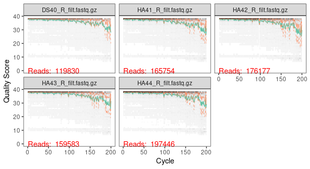

__Establishing the error rates in the data for both the forwards and reverses__
```
errF <- learnErrors(filt.dataF, multithread=TRUE)
errR <- learnErrors(filt.dataR, multithread=TRUE)
```
__Plotting the error rates__

Since every data has its own unique error profile, learnErrors function in dada2 helps in identifying this. This approach uses machine learning to guess the maximum number of error rates. The output plots show the error rates for each possible transition. In the plots below, the red line shows the expected error profile, black line shows the estimated error profile after convergence of the machine learning algorithm while the black dots represents the error rates for each possible base transition based on quality score.Here, the estimated error rates are a good fit to the observed rates and the error rates drop with increased quality as expected.

```
plotErrors(errF, nominalQ=TRUE)
```


```
plotErrors(errR, nominalQ=TRUE)
```
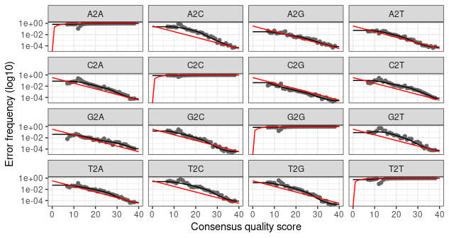


__Denoising__
```
dadaF <- dada(filt.dataF, err=errF, multithread=TRUE)
```
      Sample 1 - 115628 reads in 10810 unique sequences.
      Sample 2 - 160148 reads in 15025 unique sequences.
      Sample 3 - 169970 reads in 11089 unique sequences.
      Sample 4 - 154615 reads in 10738 unique sequences.
      Sample 5 - 191037 reads in 14442 unique sequences.
```
dadaR <- dada(filt.dataR, err=errR, multithread=TRUE)
```
      Sample 1 - 115628 reads in 15586 unique sequences.
      Sample 2 - 160148 reads in 24454 unique sequences.
      Sample 3 - 169970 reads in 23645 unique sequences.
      Sample 4 - 154615 reads in 20046 unique sequences.
      Sample 5 - 191037 reads in 24843 unique sequences.
__Inspecting the resulting dada2 class object__
```
dadaF[[1]]
```
      dada-class: object describing DADA2 denoising results
      128 sequence variants were inferred from 10810 input unique sequences.
      Key parameters: OMEGA_A = 1e-40, OMEGA_C = 1e-40, BAND_SIZE = 16
```
dadaR[[1]]
```
      dada-class: object describing DADA2 denoising results
      85 sequence variants were inferred from 15586 input unique sequences.
      Key parameters: OMEGA_A = 1e-40, OMEGA_C = 1e-40, BAND_SIZE = 16

__merging the forward and reverse reads__
```
merge.reads <- mergePairs(dadaF, filt.dataF, dadaR, filt.dataR, verbose=FALSE)
head(merge.reads[[1]])
```
__generating a sequence table__
```
seqtab <- makeSequenceTable(merge.reads)
dim(seqtab)
```
        [1]    56 11233
```
table(nchar(getSequences(seqtab))) #establishing the number of samples distributed per length
```
__Removing chimeras__

Chimeras are common in amplicon sequencing since closely related sequences are amplified. They are believed to arise from incomplete extension during PCR. During PCR partially extended strands bind to a template derived from a different but similar sequence. since the error estimation model does not remove chimeras, our sequences still contain them. in this step, chimeric sequences are removed by comparing each inferred sequence to the others in the table, and removing those that can be reproduced by stitching together two or more abudant sequences. Although the exact numbers of chimeras vary substantially per experimental conditions, its common for chimeras to constitute a large chunk of inferred amplicon sequenc variants (ASVs), but only a small fraction of all reads.
```
seqtab.nochim <- removeBimeraDenovo(seqtab, method="consensus", multithread=TRUE, verbose=TRUE)
```
        Identified 8505 bimeras out of 11233 input sequences.
```
dim(seqtab.nochim)
```
        [1]   56 2728
```
sum(seqtab.nochim)/sum(seqtab) #Establishing the percentage of non_chimeric reads
```
        [1] 0.9673027

__Tracking the number of reads that passed the various steps in the pipeline__
```
getN <- function(x) sum(getUniques(x))
track.nbr.reads <- cbind(out, sapply(dadaF, getN), sapply(dadaR, getN), sapply(merge.reads, getN), rowSums(seqtab.nochim))
colnames(track.nbr.reads) <- c("input", "filtered", "denoisedF", "denoisedR", "merged", "nonchim")
rownames(track.nbr.reads) <- list.sample.names
head(track.nbr.reads)
```
                input filtered denoisedF denoisedR merged nonchim per_retained
        DS40 135133   119830    119694    119775 118787  117805         87.2
        HA41 193469   165754    165574    165561 164951  163289         84.4
        HA42 204214   176177    176071    176025 175638  175009         85.7
        HA43 188712   159583    159383    159540 158904  158827         84.2
        HA44 225921   197446    197148    197216 196006  184123         81.5
        HA45 222641   189535    189193    189136 187394  172257         77.4

check whether you retain majority of the reads and there is no overly large drop associated with any single step. If a majority of the reads were removed as chimeras, one may need to revisit the removal of primers as ambigous reads in unremoved primers interfere with chimera identification. if majority of the reads fail to merge, the culprit could also be unremoved primers or biological length variation resulting in no overlap.

__Taxonomic classification__

The DADA2 package provides a native implementation of the naive Bayesian classifier method for taxonomic assignment. The assignTaxonomy function takes as input a set of sequences to ba classified. Dada2 provides the silva database for bacteria classification which can be [found here](http://benjjneb.github.io/dada2/training.html). The Silva SSU taxonomic training data formatted for DADA2 (Silva version 138) can be downloaded from [Zenodo](https://zenodo.org/record/3986799#.X0zzxNwzbIU).
```
# download the required databases from zenodo
download.file("https://zenodo.org/record/3986799/files/silva_nr99_v138_train_set.fa.gz", "silva_nr99_v138_train_set.fa.gz")
download.file("https://zenodo.org/record/3986799/files/silva_species_assignment_v138.fa.gz", "silva_species_assignment_v138.fa.gz")
download.file("https://zenodo.org/record/3986799/files/silva_nr99_v138_wSpecies_train_set.fa.gz","silva_nr99_v138_wSpecies_train_set.fa.gz")
```
```
taxa <- assignTaxonomy(seqtab.nochim, "silva_nr_v138_train_set.fa.gz", multithread=TRUE)
taxa <- addSpecies(taxa, "silva_species_assignment_v138.fa.gz") #classification at species level
taxa.print <- taxa

```

__Defining the rownames for the three table__
```
asv_headers <- vector(dim(seqtab.nochim)[2], mode="character")

for (i in 1:dim(seqtab.nochim)[2]) {
  asv_headers[i] <- paste(">ASV", i, sep="_")
}

head(asv_headers)
```
        [1] ">ASV_1" ">ASV_2" ">ASV_3" ">ASV_4" ">ASV_5" ">ASV_6"

__Generating output sequence, taxonomy and count tables__
```
library(tidyverse)

#Generating sequence table
seqs <- getSequences(seqtab.nochim)
asv_fasta <- c(rbind(asv_headers, seqs))
head(asv_fasta)
write(asv_fasta, "stingless_ASV.fasta") #writing the fasta file format of the sequences

#creating a sequence table dataframe
names(seqs) <- sub(">", "", asv_headers)
seqs <- as.data.frame(seqs)
seqs <- seqs %>% rownames_to_column(var = "OTU")

#Generating a feature table with newly defined row names
count_asv_tab <- t(seqtab.nochim)
row.names(count_asv_tab) <- sub(">", "", asv_headers)
write.table(count_asv_tab, "ASVs_counts.tsv", sep="\t", quote=F, col.names=NA)

#Generating a taxonomy table with the newly defined row names
rownames(taxa.print) <- gsub(pattern=">", replacement="", x=asv_headers)
head(taxa.print)
write.csv(taxa.print, file="ASVs_taxonomy.csv")
```
__Converting taxonomy and feature tables to a phyloseq object__

A phyloseq object organizes and synthesizes the different data types from a typical amplicon sequencing experiment into a single data object that can be easily manipulated. In this case we create a phyloseq object constituted of the feature table, taxonomy table and the sample metadata.
```
library(phyloseq)
TAX = tax_table(taxa.print) #taxonomy table
OTU = otu_table(count_asv_tab, taxa_are_rows = TRUE) #feature table

#Reading the sample metadata into R and converting it into a phyloseq object
library(dplyr)
sdata <- read.csv("stingless_bee_sample_metadata.csv", sep = ',', header = TRUE) 

#Reading the metadata into R and converting it into a phyloseq object
colnames(sdata) <- c("sample_id", "species")
sdata1 <- sdata %>% remove_rownames %>% column_to_rownames(var="Sample.id")
samdata = sample_data(sdata1)

#creating a phyloseq object
physeq = phyloseq(OTU, TAX, samdata)
physeq
```
        phyloseq-class experiment-level object
        otu_table()   OTU Table:         [ 2728 taxa and 56 samples ]
        sample_data() Sample Data:       [ 56 samples by 2 sample variables ]
        tax_table()   Taxonomy Table:    [ 2728 taxa by 7 taxonomic ranks ]

__filtering the unwanted sequences__
```
physeq0 <- subset_taxa(physeq, (Order!="Chloroplast") | is.na(Order))
ntaxa(physeq0)
[1] 2590
physeq0 <- subset_taxa(physeq0, (Phylum!="Chloroflexi") | is.na(Phylum))
ntaxa(physeq0)
[1] 2586
physeq0 <- subset_taxa(physeq0, (Family!="Mitochondria") | is.na(Family))
ntaxa(physeq0)
[1] 2525
physeq0 <- subset_taxa(physeq0, (Kingdom!="Archaea") | is.na(Kingdom))
ntaxa(physeq0)
[1] 2524
newPhyloObject = subset_samples(physeq0, sample_names(physeq0) != "NC68") #REmoving the negative control
```
__Filtering OTUs and taxa with an abundance less than five__
```
filtered_physeq <- prune_taxa(taxa_sums(newPhyloObject) > 5, newPhyloObject)
filtered_physeq
```
        phyloseq-class experiment-level object
        otu_table()   OTU Table:         [ 2183 taxa and 55 samples ]
        sample_data() Sample Data:       [ 55 samples by 2 sample variables ]
        tax_table()   Taxonomy Table:    [ 2183 taxa by 7 taxonomic ranks ]

__creating phyloseq objects for taxa classified and unclassified at the genus level__
```
physeq1 <- subset_taxa(filtered_physeq, (is.na(Genus)))
ntaxa(physeq1)
[1] 486
physeq2 <- subset_taxa(filtered_physeq, (!is.na(Genus)))
ntaxa(physeq2)
[1] 1697
```
__Extracting the filtered taxonomy and feature tables for barplot plotting__
```
library(metagMisc)
tax_table <- phyloseq_to_df(physeq1, addtax = T, addtot = F, addmaxrank = F)
silva_classified <- phyloseq_to_df(physeq2, addtax = T, addtot = F, addmaxrank = F)
```
__merging the genus unclassified taxonomy table to the sequence table__
```
library(tidyverse)
to_blast <- merge(seqs, tax_table, by = 'OTU', all = FALSE)
to_blast <- to_blast %>% select(OTU, seqs) #Extracting the sequence table
blast_abundance <- tax_table[,c(1, 9:63)] #Extracting the abundance table
library(seqRFLP)
to_blast_dada2_BSF_sequences <- dataframe2fas(to_blast, file = "to_blast_dada2_BSF_sequences.fasta") #converting the sequence table to FASTA format
```
__Running blast__
```
blastn = "/opt/apps/blast/2.10.0+/bin/blastn"
blast_db = "16SMicrobial_v4/16SMicrobial"
input = "to_blast_dada2_BSF_sequences.fasta"
evalue = 1e-6
format = 6
max_target = 1

colnames <- c("qseqid",
              "sseqid",
              "evalue",
              "bitscore",
              "sgi",
              "sacc")
              
blast_out <- system2("/opt/apps/blast/2.10.0+/bin/blastn", 
                     args = c("-db", blast_db, 
                              "-query", input, 
                              "-outfmt", format, 
                              "-evalue", evalue,
                              "-max_target_seqs", max_target,
                              "-ungapped"),
                     wait = TRUE,
                     stdout = TRUE) %>%
  as_tibble() %>% 
  separate(col = value, 
           into = colnames,
           sep = "\t",
           convert = TRUE)

#Removing .1-9 string to get the rightful accession numbers
blast_out$sacc <- gsub(".[.1-9]$", "", blast_out$sseqid)
```
__Filling the full taxonomic classification from the blast results__
```
library(taxonomizr)
sacc <- as.vector(blast_out$sacc)
taxaId<-accessionToTaxa(sacc,"accessionTaxa.sql",version='base')
print(taxaId)
blast_taxa<-getTaxonomy(taxaId,'accessionTaxa.sql', rownames = FALSE)
print(blast_taxa)
blast_taxa <- as.data.frame(blast_taxa)
write.csv(blast_taxa, "blast_taxonomy.csv")
blast_taxa <- read.csv("blast_taxonomy.csv", sep = ',', header = TRUE)
blast_taxa$OTU <- blast_out$qseqid
```
__Removing the first staxids and making the OTU collumn the first__
```
blast_taxa <- subset(blast_taxa, select = -X)
new_df <-blast_taxa %>%
  select(OTU, everything())
  ```
__checking for the presence of duplicates in the blast output__
```
anyDuplicated(new_df$OTU)
blast_results <- new_df[!duplicated(new_df$OTU),]
#changing the collumn names
colnames(blast_results) <- c("OTU", "Kingdom", "Phylum", "Class", "Order", "Family", "Genus", "Species")
```

__Merging the blast taxonomic clssification to blast abundance table__
```
merged_data <- merge(blast_results, blast_abundance, by = "OTU", all = FALSE)
#merging the silva classified taxonomy with the blast classified ones
silva_blast <- as.data.frame(bind_rows(silva_classified, merged_data))
```
__Extracting the feature table to use for classification at the genus level__
```
Featured_table <- silva_blast[,c(7,9:63)]
#grouping the data
group <- Featured_table %>%
  group_by(Genus)%>%
  summarise_if(is.numeric, sum)
  ```
  ```
group <- Featured_table %>%
  group_by(Genus)%>%
  summarise_each(funs(sum), "HA41","HA42","HA43","HA44","HA45","HA46","HA47","HA50","HG56","HG57","LG74","LG75","LG76",
                 "LG77","LN71","LN72","LN73","MB10","MB1","MB3","MB4","MB5","MB6", "MB7","MB8","MFB16","MFB17","MFB18","MFB19",
                 "MFB20","MFB26","MFB27","MFB28","MFB29","MFB30","MFR11","MFR12","MFR13","MFR14","MFR15","MFR21","MFR22","MFR23","MFR24",
                 "MFR25","DS35","DS36","DS37","DS38","DS39","DS40","DS31","DS32","DS33","DS34")
View (group)
```
__Creating multiple dataframes for the different species__
```
K_HA <- group[,c(1:9)]
K_HG <- group[,c(1,10,11)]
K_LG <-group[,c(1,12:15)]
K_LN <- group[,c(1,16:18)]
K_MB <-group[,c(1,19:26)]
K_MFB <-group[,c(1,27:36)]
K_MFR <- group[,c(1,37:46)]
K_DS <-group[,c(1,47:56)]
```
```
K_HA_total <- K_HA %>% adorn_totals(c("col"))
K_HA_total <- mutate(K_HA_total, K_HA=rowSums(K_HA_total[10])/8)
K_HA_total <- K_HA_total[,c(1,11)]

K_HG_total <- K_HG %>% adorn_totals(c("col"))
K_HG_total <- mutate(K_HG_total, K_HG=rowSums(K_HG_total[4])/2)
K_HG_total <- K_HG_total[,c(1,5)]

K_LG_total <- K_LG %>% adorn_totals(c("col"))
K_LG_total <- mutate(K_LG_total, K_LG=rowSums(K_LG_total[6])/4)
K_LG_total <- K_LG_total[,c(1,7)]

K_LN_total <- K_LN %>% adorn_totals(c("col"))
K_LN_total <- mutate(K_LN_total, K_LN=rowSums(K_LN_total[5])/3)
K_LN_total <- K_LN_total[,c(1,6)]

K_MB_total <- K_MB %>% adorn_totals(c("col"))
K_MB_total <- mutate(K_MB_total, K_MB=rowSums(K_MB_total[10])/8)
K_MB_total <- K_MB_total[,c(1,11)]

K_MFB_total <- K_MFB %>% adorn_totals(c("col"))
K_MFB_total <- mutate(K_MFB_total, K_MFB=rowSums(K_MFB_total[12])/10)
K_MFB_total <- K_MFB_total[,c(1,13)]

K_MFR_total <- K_MFR %>% adorn_totals(c("col"))
K_MFR_total <- mutate(K_MFR_total, K_MFR=rowSums(K_MFR_total[12])/10)
K_MFR_total <- K_MFR_total[,c(1,13)]

K_DS_total <- K_DS %>% adorn_totals(c("col"))
K_DS_total <- mutate(K_DS_total, K_DS=rowSums(K_DS_total[12])/10)
K_DS_total <- K_DS_total[,c(1,13)]
```
__Merging the above dataframes__
```
merged <- Reduce(function(x,y) merge(x,y,by="Genus",all=TRUE) ,list(K_HA_total,K_LG_total,K_LN_total, K_MB_total, K_MFB_total, K_MFR_total, K_DS_total))
```
__calculating and ordering the genus from the most abundant__
```
library(janitor)
cumulation <- merged %>% adorn_totals(c("col"))
cumulation <- cumulation[order(cumulation$Total, decreasing = TRUE),]
```
__specifying the taxa to be tabulated__
```
to_represent <- c("Lactobacillus", "Snodgrassella", "Saccharibacter","Bifidobacterium", "Neokomagataea", "	Saccharibacter","Bombella","	Ameyamaea",
                  "Wolbachia","Nguyenibacter", "Zymobacter", "Acinetobacter", "Gluconacetobacter", "Enterococcus", "Acetobacter", "Alkanindiges", "Chryseobacterium") 
```

__aggregating the rest of the phyla as others__
```
grouped_data <- aggregate(merged[-1], list(Genus = replace(merged$Genus,!(merged$Genus %in% to_represent), "Others")), sum)
View(grouped_data) 
```
__converting the abundance into percentage__
```
bar <- adorn_percentages(grouped_data, denominator = "col", na.rm = TRUE)
```
__Gathering the data__
```
bar <- bar %>%
  gather(value = "abundance", key = "sample_names", -Genus)
```
__ordering the data on abundance basis for plotting__
```
bar$Genus <- reorder(bar$Genus, bar$abundance)
bar$Genus <- factor(bar$Genus, levels=rev(levels(bar$Genus)))
```
__Choosing the colours to use in the barplot__
```
myPalette <- c('#89C5DA', "#DA5724", "#74D944", "#CE50CA", "#3F4921", "#C0717C", "#CBD588", "#5F7FC7", "#673770", "#D3D93E", "#38333E", "#508578", "#D7C1B1", "#689030", "#AD6F3B", "#CD9BCD", "#D14285", "#6DDE88", "#652926", "#7FDCC0", "#C84248", "#8569D5", "#5E738F", "#D1A33D", "#8A7C64", "#599861")
```
__plotting the barplot__
```
ggplot(bar,aes(x = sample_names, y = abundance))+geom_col(aes(fill = Genus),position = position_stack(reverse = FALSE))+
  theme(axis.text.x = element_text(angle = 90, hjust = 1))+
  scale_fill_manual(values = myPalette)
```
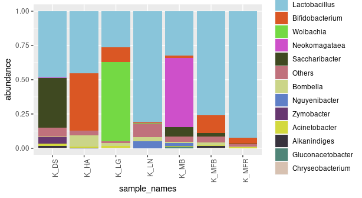

__Beta diversity estimation__
```
#Drawing the venn diagrams
#Removing all genuses with zero hits in the dataframes
K_HA<- K_HA_total[!(K_HA_total$K_HA == 0),]
K_HG<- K_HG_total[!(K_HG_total$K_HG == 0),]
K_LG<- K_LG_total[!(K_LG_total$K_LG == 0),]
K_LN<- K_LN_total[!(K_LN_total$K_LN == 0),]
K_MB<- K_MB_total[!(K_MB_total$K_MB == 0),]
K_MFB <- K_MFB_total[!(K_MFB_total$K_MFB == 0),]
K_MFR<- K_MFR_total[!(K_MFR_total$K_MFR == 0),]
K_DS<- K_DS_total[!(K_DS_total$K_DS == 0),]
```
__selecting the collumn for plotting the venn diagrams from the dataframe__
```
HA <- K_HA %>% select(Genus)
HG <- K_HG %>% select(Genus)
LG <- K_LG %>% select(Genus)
LN <- K_LN %>% select(Genus)
MB <- K_MB %>% select(Genus)
MFB<- K_MFB %>% select(Genus)
MFR<- K_MFR %>% select(Genus)
DS<- K_DS %>% select(Genus)
```
__plotting the venn diagram__
```
library(gplots)
vd <- list(HA, LG, MFB, MFR, DS)
names(vd) = c("HA", "LG","MFB", "MFR", "DS")
venn(vd)
```
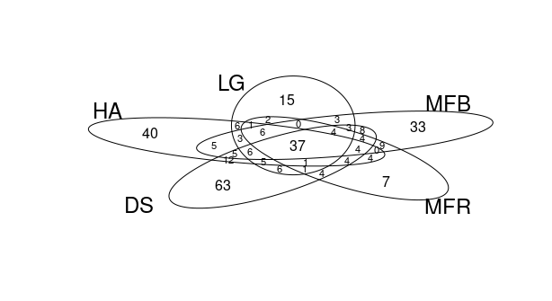

__Extracting sequences to be included in the study for plotting phylogenetic trees and converting them to FASTA format__
```
seq <- merge(seqs, silva_blast, by = "OTU", all = FALSE)
seq <- seq %>% select(OTU,seqs)
phylo_sequences <- dataframe2fas(seq, file = "phylo_sequences.fasta") #converting to FASTA file
```
__Reading the FASTA sequences back to R__
```
phylo_sequences <- readDNAStringSet("phylo_sequences.fasta")
names(phylo_sequences)
```

__Constructing the phylogenetic tree__

Phylogenetic relatedness is used to inform downstream analysis especially in the case of phylogenetic related distances between microbial communities. sequence alignment in this case has been done using DECIPHER an R package useful in sequence alignments. The Phangorn R package has been used to construct the phylogenetic tree. Here we first construct a neighbour joining tree and then fit a GTR+G+I (Generalized time reversible with Gamma rate variation) maximum likelihood using the neighnour joining as a strating point. 
```
#Multiple sequence alignment
library(DECIPHER)
alignment <- AlignSeqs(phylo_sequences, anchor = NA)

library(phangorn)
phang.align <- phyDat(as(alignment, "matrix"), type="DNA")
dm <- dist.ml(phang.align)
treeUPGMA <- upgma(dm) #rooted tree
fit = pml(treeNJ, data=phang.align)
#fitting the tree using the GTR model
fitGTR <- update(fit, k=4, inv=0.2) 
fitGTR <- optim.pml(fitGTR, model="GTR", optInv=TRUE, optGamma=TRUE,
                    rearrangement = "stochastic", control = pml.control(trace = 0)) 
#saving the tree and reading it back to R
saveRDS(fitGTR, "stingless_bee_phangorn_tree.RDS")
phangorn <- readRDS("stingless_bee_phangorn_tree.RDS")
#Extracting the tree from the GTR model
phylo_tree <- phangorn$tree
phylogenetic_tree <- phy_tree(phylo_tree)
```
__PCoA analysis__
```
#Extracting the taxonomy and abundance tables from the dataframe named silva blast__
taxonomy_table <- silva_blast[,c(1:8)] #Extracts all the taxonomic ranks from the dataframe
features <-silva_blast[,c(1,9:63)] #Extracts all the abundance collumn for the different samples from the dataframe
```
__converting the taxonomy and feature tables to a matrix then phyloseq object__
```
#taxonomy table
my_taxonomy <- taxonomy_table %>% remove_rownames %>% column_to_rownames(var="OTU")
my_taxonomy <- as.matrix(my_taxonomy)
TAX2= tax_table(my_taxonomy)
```
```
#feature table
my_feature_table <- features %>% remove_rownames %>% column_to_rownames(var="OTU")
my_feature_table <- as.matrix(my_feature_table)
OTU2 = otu_table(my_feature_table, taxa_are_rows = TRUE)
```
```
#creating a phyloseq object
physeq3 = phyloseq(TAX2, OTU2, samdata,phylogenetic_tree)
physeq3
```
__Normalizing the data__
```
total = median(sample_sums(physeq3))#finds median sample read count
standf = function(x, t=total) round(t * (x / sum(x)))#function to standardize to median sample read count
standardized_physeq = transform_sample_counts(physeq3, standf)#apply to phyloseq object
ntaxa(standardized_physeq)
sample_sums(standardized_physeq)
```
__ordinating the phyloseq object__
```
library(vegan)
ordu = ordinate(physeq3, "PCoA", "unifrac", weighted=TRUE) #weighted unifrac
plot_ordination(physeq3, ordu, color="species")+ geom_point(size=2) +
  scale_color_manual(values = myPalette)
```
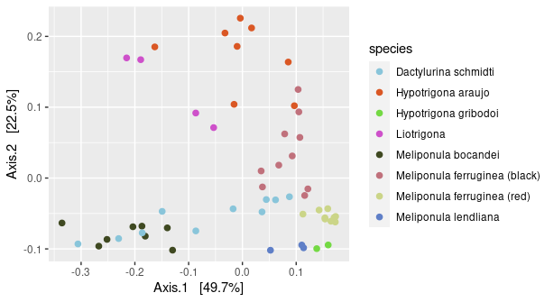
```
ordu = ordinate(physeq3, "PCoA", "unifrac", weighted=FALSE) #unweighted unifrac
plot_ordination(physeq3, ordu, color="species")+ geom_point(size=2) +
  scale_color_manual(values = myPalette)
```
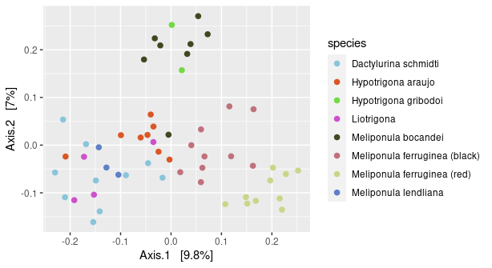
```
ordu = ordinate(physeq3, "PCoA", "bray")
plot_ordination(physeq3, ordu, color="species")+ geom_point(size=2) +
  scale_color_manual(values = myPalette)
```
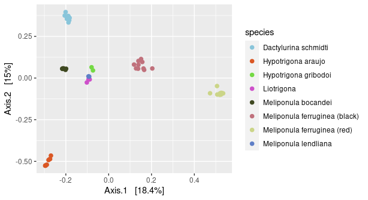

__Alpha diversity estimation__
```
physeq4 <- phyloseq(TAX2, OTU2, samdata, phylogenetic_tree) #creating a phyloseq object
physeq4
reads <- sample_sums(physeq4) #number of reads per sample in the creating phyloseq object
reads
summary(sample_sums(physeq4)) #summarizes the interquatile ranges and the least to highest reads in a sample
```
__Extracting the otu table from the phyloseq object and plotting the rarefaction curve__
```
library(microbiome)
otu_tab <- t(abundances(physeq4))
p <- vegan::rarecurve(otu_tab, 
                      step = 50, label = FALSE, 
                      sample = min(rowSums(otu_tab), 
                                   col = "blue", cex = 0.6))
```
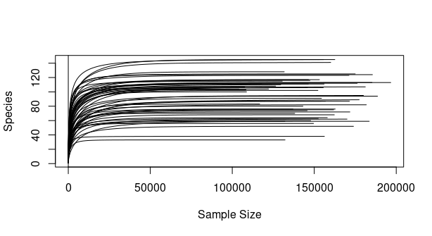

__calculatin an even sampling depth for all the samples__
```
set.seed(9242)  #for reproducibility
rarefied <- rarefy_even_depth(physeq4, sample.size = 106927)
rarefied
```
__alpha diversity estimation__
```
diversity <- alpha(rarefied, index = "all")
diversity <- rownames_to_column(diversity, "sample_id")
```
__Extracting the sample metadata from the phyloseq object__
```
sdata1 <- meta(physeq4)
sdata1 <- rownames_to_column(sdata1, "sample_id")
```
__Extracting the shannon diversity index__
```
shannon <- diversity %>% select(sample_id, diversity_shannon)
shannon_editted <- merge(shannon, sdata1, by = "sample_id", all = TRUE)
```
__confirming if the shannon indices are normally distributed__
```
shapiro.test(shannon_editted$diversity_shannon) #checks if the data is parametric or not
```
__Plotting the alpha diversity plots using shannon index__
```
library(ggpubr)
p <- ggplot(shannon_editted, aes(x=species, y=diversity_shannon)) + geom_boxplot(aes(fill = species)) +
  theme(axis.text.x = element_text(angle = 90, hjust = 1)) + stat_compare_means()

p
```
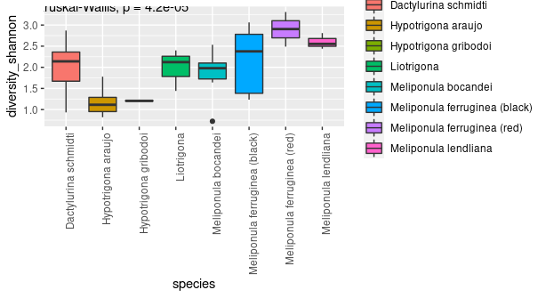

