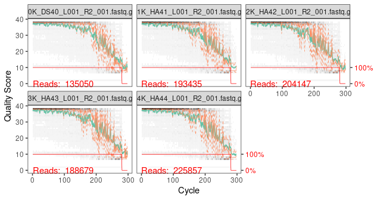
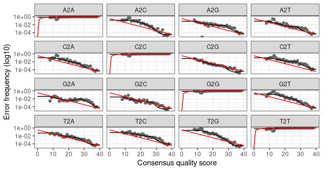

# 16S Gut Microbiota Analysis Pipeline using DADA2
This repo contains an R script that can be used in the analysis of 16S gut microbiome data. The scripts were developed by analysing the gut microbiome data from stingless bees. The 16S data was generated from an illumina platform by sequencing the V3-V4 region. The sequences used in developing this  script are paired end reads which have already been demultiplexed but still contain primers. The DADA2 workflow was adopted in this analysis because it is highly sensitive and specific as compared to other OTU picking algorithms, it can resolve single-nucleotide differences from amplicon data and classify them into Amplicon Sequence Variants (ASVs) and it contains an error correction model that helps in improving the quality of reads by helping best infer the original true bilogical sequences present in the data. More about Dada2 can be found in the Dada2 paper https://www.ncbi.nlm.nih.gov/pmc/articles/PMC4927377/, Dada2 tutorial https://benjjneb.github.io/dada2/tutorial.html and the Dada2 manual https://www.bioconductor.org/packages/3.3/bioc/manuals/dada2/man/dada2.pdf.

__Working around with the data__

Load the dada2 package into R. If you have not installed dada2, follow the turorial here http://benjjneb.github.io/dada2/dada-installation.html
```
library(dada2)
```

__Reading the fastq files into R__
```
file_path <- "stingless_bee/"
list.files(file_path)
```
      [1] "10K_DS40_L001_R1_001.fastq.gz"  "10K_DS40_L001_R2_001.fastq.gz" 
      [3] "11K_HA41_L001_R1_001.fastq.gz"  "11K_HA41_L001_R2_001.fastq.gz" 
      [5] "12K_HA42_L001_R1_001.fastq.gz"  "12K_HA42_L001_R2_001.fastq.gz" 
      [7] "13K_HA43_L001_R1_001.fastq.gz"  "13K_HA43_L001_R2_001.fastq.gz" 
      [9] "14K_HA44_L001_R1_001.fastq.gz"  "14K_HA44_L001_R2_001.fastq.gz" 
      [11] "15K_HA45_L001_R1_001.fastq.gz"  "15K_HA45_L001_R2_001.fastq.gz" 
      [13] "16K_HA46_L001_R1_001.fastq.gz"  "16K_HA46_L001_R2_001.fastq.gz" 
      [15] "17K_HA47_L001_R1_001.fastq.gz"  "17K_HA47_L001_R2_001.fastq.gz" 
      [17] "18K_HA50_L001_R1_001.fastq.gz"  "18K_HA50_L001_R2_001.fastq.gz" 
      [19] "19K_HG56_L001_R1_001.fastq.gz"  "19K_HG56_L001_R2_001.fastq.gz" 
      [21] "1K_DS31_L001_R1_001.fastq.gz"   "1K_DS31_L001_R2_001.fastq.gz"  
      [23] "20K_HG57_L001_R1_001.fastq.gz"  "20K_HG57_L001_R2_001.fastq.gz" 
      [25] "21K_LG74_L001_R1_001.fastq.gz"  "21K_LG74_L001_R2_001.fastq.gz" 
      [27] "22K_LG75_L001_R1_001.fastq.gz"  "22K_LG75_L001_R2_001.fastq.gz" 
      [29] "23K_LG76_L001_R1_001.fastq.gz"  "23K_LG76_L001_R2_001.fastq.gz" 
      [31] "24K_LG77_L001_R1_001.fastq.gz"  "24K_LG77_L001_R2_001.fastq.gz" 
      [33] "25K_LN71_L001_R1_001.fastq.gz"  "25K_LN71_L001_R2_001.fastq.gz" 
      [35] "26K_LN72_L001_R1_001.fastq.gz"  "26K_LN72_L001_R2_001.fastq.gz" 
      [37] "27K_LN73_L001_R1_001.fastq.gz"  "27K_LN73_L001_R2_001.fastq.gz" 
      [39] "28K_MB10_L001_R1_001.fastq.gz"  "28K_MB10_L001_R2_001.fastq.gz" 
      [41] "29K_MB1_L001_R1_001.fastq.gz"   "29K_MB1_L001_R2_001.fastq.gz"  
      [43] "2K_DS32_L001_R1_001.fastq.gz"   "2K_DS32_L001_R2_001.fastq.gz"  
      [45] "30K_MB3_L001_R1_001.fastq.gz"   "30K_MB3_L001_R2_001.fastq.gz"  
      [47] "31K_MB4_L001_R1_001.fastq.gz"   "31K_MB4_L001_R2_001.fastq.gz"  
      [49] "32K_MB5_L001_R1_001.fastq.gz"   "32K_MB5_L001_R2_001.fastq.gz"  
      [51] "33K_MB6_L001_R1_001.fastq.gz"   "33K_MB6_L001_R2_001.fastq.gz"  
      [53] "34K_MB7_L001_R1_001.fastq.gz"   "34K_MB7_L001_R2_001.fastq.gz"  
      [55] "35K_MB8_L001_R1_001.fastq.gz"   "35K_MB8_L001_R2_001.fastq.gz"  
      [57] "36K_MFB16_L001_R1_001.fastq.gz" "36K_MFB16_L001_R2_001.fastq.gz"
      [59] "37K_MFB17_L001_R1_001.fastq.gz" "37K_MFB17_L001_R2_001.fastq.gz"
      [61] "38K_MFB18_L001_R1_001.fastq.gz" "38K_MFB18_L001_R2_001.fastq.gz"
      [63] "39K_MFB19_L001_R1_001.fastq.gz" "39K_MFB19_L001_R2_001.fastq.gz"
      [65] "3K_DS33_L001_R1_001.fastq.gz"   "3K_DS33_L001_R2_001.fastq.gz"  
      [67] "40K_MFB20_L001_R1_001.fastq.gz" "40K_MFB20_L001_R2_001.fastq.gz"
      [69] "41K_MFB26_L001_R1_001.fastq.gz" "41K_MFB26_L001_R2_001.fastq.gz"
      [71] "42K_MFB27_L001_R1_001.fastq.gz" "42K_MFB27_L001_R2_001.fastq.gz"
      [73] "43K_MFB28_L001_R1_001.fastq.gz" "43K_MFB28_L001_R2_001.fastq.gz"
      [75] "44K_MFB29_L001_R1_001.fastq.gz" "44K_MFB29_L001_R2_001.fastq.gz"
      [77] "45K_MFB30_L001_R1_001.fastq.gz" "45K_MFB30_L001_R2_001.fastq.gz"
      [79] "46K_MFR11_L001_R1_001.fastq.gz" "46K_MFR11_L001_R2_001.fastq.gz"
      [81] "47K_MFR12_L001_R1_001.fastq.gz" "47K_MFR12_L001_R2_001.fastq.gz"
      [83] "48K_MFR13_L001_R1_001.fastq.gz" "48K_MFR13_L001_R2_001.fastq.gz"
      [85] "49K_MFR14_L001_R1_001.fastq.gz" "49K_MFR14_L001_R2_001.fastq.gz"
      [87] "4K_DS34_L001_R1_001.fastq.gz"   "4K_DS34_L001_R2_001.fastq.gz"  
      [89] "50K_MFR15_L001_R1_001.fastq.gz" "50K_MFR15_L001_R2_001.fastq.gz"
      [91] "51K_MFR21_L001_R1_001.fastq.gz" "51K_MFR21_L001_R2_001.fastq.gz"
      [93] "52K_MFR22_L001_R1_001.fastq.gz" "52K_MFR22_L001_R2_001.fastq.gz"
      [95] "53K_MFR23_L001_R1_001.fastq.gz" "53K_MFR23_L001_R2_001.fastq.gz"
      [97] "54K_MFR24_L001_R1_001.fastq.gz" "54K_MFR24_L001_R2_001.fastq.gz"
      [99] "55K_MFR25_L001_R1_001.fastq.gz" "55K_MFR25_L001_R2_001.fastq.gz"
      [101] "56K_NC68_L001_R1_001.fastq.gz"  "56K_NC68_L001_R2_001.fastq.gz" 
      [103] "5K_DS35_L001_R1_001.fastq.gz"   "5K_DS35_L001_R2_001.fastq.gz"  
      [105] "6K_DS36_L001_R1_001.fastq.gz"   "6K_DS36_L001_R2_001.fastq.gz"  
      [107] "7K_DS37_L001_R1_001.fastq.gz"   "7K_DS37_L001_R2_001.fastq.gz"  
      [109] "8K_DS38_L001_R1_001.fastq.gz"   "8K_DS38_L001_R2_001.fastq.gz"  
      [111] "9K_DS39_L001_R1_001.fastq.gz"   "9K_DS39_L001_R2_001.fastq.gz"
If the list of files that have been read match those you intend to analyze and your dada2 package was loaded you can start your dada2 analysis

__sorting the data into forward and reverse reads__
```
dataF <- sort(list.files(file_path, pattern="_R1_001.fastq.gz", full.names = TRUE))
dataR <- sort(list.files(file_path, pattern="_R2_001.fastq.gz", full.names = TRUE))
```
__Specifying the sample names for your dataset__
```
list.sample.names <- sapply(strsplit(basename(dataF), "_"), `[`, 2) #2 represents the second string on my sample names, if you want the first replace with 1
list.sample.names
```
      [1] "DS40"  "HA41"  "HA42"  "HA43"  "HA44"  "HA45"  "HA46"  "HA47"  "HA50"  "HG56" 
      [11] "DS31"  "HG57"  "LG74"  "LG75"  "LG76"  "LG77"  "LN71"  "LN72"  "LN73"  "MB10" 
      [21] "MB1"   "DS32"  "MB3"   "MB4"   "MB5"   "MB6"   "MB7"   "MB8"   "MFB16" "MFB17"
      [31] "MFB18" "MFB19" "DS33"  "MFB20" "MFB26" "MFB27" "MFB28" "MFB29" "MFB30" "MFR11"
      [41] "MFR12" "MFR13" "MFR14" "DS34"  "MFR15" "MFR21" "MFR22" "MFR23" "MFR24" "MFR25"
      [51] "NC68"  "DS35"  "DS36"  "DS37"  "DS38"  "DS39"

Here, you separate your forward and reverse reads and choose the string on the name of the file to be used as your sample names.

__visualizing the quality of the plots__

Visualizing the quality of your sequence data. Since most of the quality plots are closely similar in the two categories, you dont have to visualize the quality plots from all the samples in each of the categories. 
```
plotQualityProfile(dataR[1:5])
```


```
plotQualityProfile(dataF[1:5])
```


on these plot, the bases are on the X axis while the quality score is on the Y. Faint grey represents a heat map of the frequency of each quality score at each base position. Green shows the mean quality score per base and orange represents the quartiles of the quality score distribution. The forward reads generally usually have high quality bases while the reverse reads have more spurious reads as the sequencing process advances.  This plot also shows that our reads have primers as seen with the decreasing quality at the 5' end of each of the quality plots.

__Removing primers__

```
library(ShortRead)
library(Biostrings)
library(stringr)
```
```
fwd_primer <- "CCTACGGGNGGCWGCAG"
rev_primer <- "GACTACHVGGGTATCTAATCC"
```
```
#Function for creating all the possible orientations of these primers
allOrients <- function(primer) {
  require(Biostrings)
  dna <- DNAString(primer)  # The Biostrings works w/ DNAString objects rather than character vectors
  orients <- c(Forward = dna, Complement = complement(dna), Reverse = reverse(dna), 
               RevComp = reverseComplement(dna))
  return(sapply(orients, toString))  # Convert back to character vector
}
```
```
# creating all the possible orientations using our forward and reverse primers

fwd_primer_orients <- allOrients(fwd_primer)
```
        Forward          Complement             Reverse             RevComp 
      "CCTACGGGNGGCWGCAG" "GGATGCCCNCCGWCGTC" "GACGWCGGNGGGCATCC" "CTGCWGCCNCCCGTAGG" 
```
rev_primer_orients <- allOrients(rev_primer
```
              Forward              Complement                 Reverse 
      "GACTACHVGGGTATCTAATCC" "CTGATGDBCCCATAGATTAGG" "CCTAATCTATGGGVHCATCAG" 
                RevComp 
      "GGATTAGATACCCBDGTAGTC" 
```
fwd_primer_rev <- as.character(reverseComplement(DNAStringSet(fwd_primer))) # reverse complement of the primers
rev_primer_rev <- as.character(reverseComplement(DNAStringSet(rev_primer)))
```
```
# Function for counting the number of reads containing our primer orientations 
count_primers <- function(primer, filename) {
  num_hits <- vcountPattern(primer, sread(readFastq(filename)), fixed = FALSE)
  return(sum(num_hits > 0))
}
```
```
# counting the sequence strings with primers from our data 
rbind(R1_fwd_primer = sapply(fwd_primer_orients, count_primers, filename = dataF[[1]]), 
      R2_fwd_primer = sapply(fwd_primer_orients, count_primers, filename = dataF[[1]]), 
      R1_rev_primer = sapply(rev_primer_orients, count_primers, filename = dataF[[1]]), 
      R2_rev_primer = sapply(rev_primer_orients, count_primers, filename = dataF[[1]]))
```
                      Forward Complement Reverse RevComp
      R1_fwd_primer  130664          0       0       0
      R2_fwd_primer  130664          0       0       0
      R1_rev_primer       2          0       0      18
      R2_rev_primer       2          0       0      18

```
rbind(R1_fwd_primer = sapply(fwd_primer_orients, count_primers, filename = dataR[[1]]), 
      R2_fwd_primer = sapply(fwd_primer_orients, count_primers, filename = dataR[[1]]), 
      R1_rev_primer = sapply(rev_primer_orients, count_primers, filename = dataR[[1]]), 
      R2_rev_primer = sapply(rev_primer_orients, count_primers, filename = dataR[[1]]))
```
                     Forward Complement Reverse RevComp
      R1_fwd_primer     101        100      99     105
      R2_fwd_primer     101        100      99     105
      R1_rev_primer  130595         94      92      91
      R2_rev_primer  130595         94      92      91
```
#specifying the path to cutadapt on the server
cutadapt <- "/opt/apps/cutadapt/1.18/bin/cutadapt" # change to the cutadapt path on your machine
system2(cutadapt, args = "--version") # test if the version of cutadapt you loaded matches that on the server
```
```
creating an output directory to store the trimmed files and specifying the names of the samples
cut_dir <- file.path(file_path, "cutadapt")
if (!dir.exists(cut_dir)) dir.create(cut_dir)

fwd_cut <- file.path(cut_dir, basename(dataF))
rev_cut <- file.path(cut_dir, basename(dataR))

names(fwd_cut) <- list.sample.names
names(rev_cut) <- list.sample.names
```
      # function for creating cutadapt trimming log files
 ```
cut_logs <- path.expand(file.path(cut_dir, paste0(list.sample.names, ".log")))
```
```
# Function specifying the cutadapt functions to be used in this analysis
cutadapt_args <- c("-g", fwd_primer, "-g", rev_primer_rev, 
                   "-G", rev_primer, "-A", fwd_primer_rev,
                   "-n", 2, "--discard-untrimmed")
```
```
# creating a loop over the list of files and running cutadapt on each file.
for (i in seq_along(dataF)) {
  system2(cutadapt, 
          args = c(cutadapt_args,
                   "-o", fwd_cut[i], "-p", rev_cut[i], 
                   dataF[i], dataR[i]),
          stdout = cut_logs[i])  
}
```
```
# sanity check: checking for the presence of primers in the first cutadapt-ed sample.
rbind(R1_fwd_primer = sapply(fwd_primer_orients, count_primers, filename = fwd_cut[[1]]), 
      R2_fwd_primer = sapply(fwd_primer_orients, count_primers, filename = fwd_cut[[1]]), 
      R1_rev_primer = sapply(rev_primer_orients, count_primers, filename = fwd_cut[[1]]), 
      R2_rev_primer = sapply(rev_primer_orients, count_primers, filename = fwd_cut[[1]]))
```
                       Forward Complement Reverse RevComp
      R1_fwd_primer       0          0       0       0
      R2_fwd_primer       0          0       0       0
      R1_rev_primer       0          0       0       0
      R2_rev_primer       0          0       0       0
```   
rbind(R1_fwd_primer = sapply(fwd_primer_orients, count_primers, filename = rev_cut[[1]]), 
      R2_fwd_primer = sapply(fwd_primer_orients, count_primers, filename = rev_cut[[1]]), 
      R1_rev_primer = sapply(rev_primer_orients, count_primers, filename = rev_cut[[1]]), 
      R2_rev_primer = sapply(rev_primer_orients, count_primers, filename = rev_cut[[1]]))
``` 
                        Forward Complement Reverse RevComp
      R1_fwd_primer      66         66      65      70
      R2_fwd_primer      66         66      65      70
      R1_rev_primer      59         60      58      57
      R2_rev_primer      59         60      58      57

      
From the cutadapted reads, all the primers in the forward and reverse reads were completely trimmed in the first sample. However the some reverse primers still remained in the forward and reverse reads. From this github issue https://github.com/benjjneb/dada2/issues/675, we find that since the number of reverse primers that have remained are fewer than what was initially present, they would not affect downstream analysis. 

  __plotting the quality plots again to determine the length to use while filtering reads__
  ```
  plotQualityProfile(fwd_cut[1:5])
  ```
  
  ```
  plotQualityProfile(rev_cut[1:5])
  ```
  
  
__Assigning where the filtered data should be stored "filtered" directory__
```
filt.dataF <- file.path(file_path, "filtered", paste0(list.sample.names, "_F_filt.fastq.gz"))
filt.dataR <- file.path(file_path, "filtered", paste0(list.sample.names, "_R_filt.fastq.gz"))
names(filt.dataF) <- list.sample.names
names(filt.dataR) <- list.sample.names
```

__Filtering and trimming data__
```
out <- filterAndTrim(fwd_cut, filt.dataF, rev_cut, filt.dataR, truncLen=c(250,190),
                     maxN=0, maxEE=c(2,5), truncQ=2, rm.phix=TRUE,
                     compress=TRUE, multithread=TRUE)
head(out)
```
                                     reads.in reads.out
      10K_DS40_L001_R1_001.fastq.gz   135050    118110
      11K_HA41_L001_R1_001.fastq.gz   193438    163009
      12K_HA42_L001_R1_001.fastq.gz   204151    173300
      13K_HA43_L001_R1_001.fastq.gz   188679    157417
      14K_HA44_L001_R1_001.fastq.gz   225857    194954
      15K_HA45_L001_R1_001.fastq.gz   222596    186720
This step aids in trimming all low quality reads. The first and the third variables contain the input files which are primer trimmed files. The second and the third hold the file names for the output forward and reverse sequences. __MaxEE__ on the code defines the quality filtering threshold based on the expected errors. In this particular code, all sequences with more than 2 erroneous bases in the forward reads and 5 erroneous reads in the reverse reads are filtered. Ids f the reverse reads in your dataset have better quality you can set __MaxEE (2,2)__. __rm.PhiX__ aids in deleting any read similar to the PHiX bacteriophage. __truncQ = 2__ trims all the bases that appear after the first quality score of 2 it comes across in aread. __MaxN = 0__ removes any sequences containing Ns and __truncLen__ identifies the minimum size to trim the forward and reads to keep the quality scores above 25.

__Establishing the error rates in the data for both the forwards and reverses__
```
errF <- learnErrors(filt.dataF, multithread=TRUE)
errR <- learnErrors(filt.dataR, multithread=TRUE)
```
__Plotting the error rates__
```
plotErrors(errF, nominalQ=TRUE)
```


```
plotErrors(errR, nominalQ=TRUE)
```


Since every data has its own unique error profile, learnErrors function in dada2 helps in identifying this. This approach uses machine learning to guess the maximum number of error rates. The output plots show the error rates for each possible transition. The red line shows the expected error profile, black line shows the estimated error profile after convergence of the machine learning algorithm while the black dots represents the error rates for each possible base transition based on quality score.Here, the estimated error rates are a good fit to the observed rates and the error rates drop with increased quality as expected.

__Denoising__
```
dadaF <- dada(filt.dataF, err=errF, multithread=TRUE)
dadaR <- dada(filt.dataR, err=errR, multithread=TRUE)
```
__inspecting the resulting dada2 class object__
```
dadaF[[1]]
dadaR[[1]]
```
__merging the forward and reverse reads__
```
merge.reads <- mergePairs(dadaF, filt.dataF, dadaR, filt.dataR, verbose=FALSE)
head(merge.reads[[1]])
```
__generating a sequence table__
```
seqtab <- makeSequenceTable(merge.reads)
dim(seqtab)
table(nchar(getSequences(seqtab))) #establishing the number of samples distributed per length
```
__Removing chimeras__
```
seqtab.nochim <- removeBimeraDenovo(seqtab, method="consensus", multithread=TRUE, verbose=TRUE)
dim(seqtab.nochim)
sum(seqtab.nochim)/sum(seqtab) #Establishing the percentage of non_chimeric reads
```
__Tracking the number of reads that passed the various steps in the pipeline__
```
getN <- function(x) sum(getUniques(x))
track.nbr.reads <- cbind(out, sapply(dadaF, getN), sapply(dadaR, getN), sapply(merge.reads, getN), rowSums(seqtab.nochim))
colnames(track.nbr.reads) <- c("input", "filtered", "denoisedF", "denoisedR", "merged", "nonchim")
rownames(track.nbr.reads) <- list.sample.names
head(track.nbr.reads)
```
__Taxonomic classification__
```
taxa <- assignTaxonomy(seqtab.nochim, "silva_nr_v138_train_set.fa.gz", multithread=TRUE)
```
